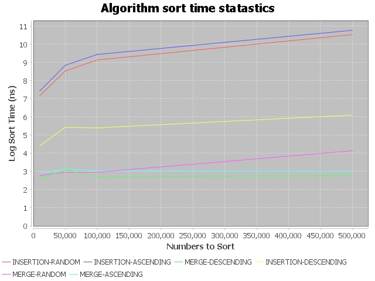

# SortAlgorithmsTimeCharter
This program generates data and creates a chart comparing the execution time of different sort algorithms. Arguments can be passed in with the command line args to test on 
different sizes and arangements of data. The program generates a .jpeg chart comparing NumberCount vs. SortTime 

## Running
The project is run from the command line with arguments passed in on the command line. Running just the jar will print an example input for the program.

### Example Input
"java -jar SortAlgorithmsTimeCharter-1.0.jar  -numberCount 10000 100000 1000000 -numberLength 50000 -preSort forward reverse random"
This input would generate 3*3*1 = 9 sets of numbers. One for each numberCount numberLength and presort combination. The program would then sort the each set of numbers with 
merge sort and insert sort and then generate a graph comparing the dataSize vs executionTime for each run.

### Example Output

